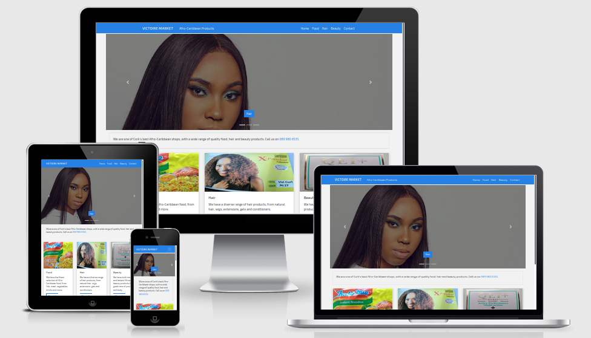

# Code Institute Milestone 1 project

## Victoire Market
This project is the first milestone project for the Code Institute Full Stack Software Development Diploma.
Build a website for the Code Institute User Centric module. I have chosen to build a website for a retail shop in Cork, Ireland. The link for the website: [Victoire Market](https://www.victoiremarket.com/).  

 ## Design Planning

A planning document for the website can be found [here](planning.md) which details the planning of the UX and UI. I used [Figma link to intial design](https://www.figma.com/file/baVcQW3gP3tkihBhWwWeizus/webDraftProject1?node-id=0%3A1) for the intial website design of the homepage.

  - The website advertises a retail shop, Victoire Market, that sells Afro-Caribbean products (food, hair and beauty).
  - The aim is for an attractive, simple, easy to use website that advertises the products available in distinct categories.
  - Contact information is readily available, with well planned navigation and a contact page.

## Website content

The website consists of five pages, including a homepage, three product pages and a contact page.

## Website Style

- One colour theme of blue throughout for visual consistency. 
- A modern sans serif font of Exo 2 throughout.
- An off white background with dark grey text for optimum readability.

## Website Features

- Visually attractive sliding carousel on homepage to advertise products.
- Responsive navigation with "hamburger" drop down menu icon for small screens.
- A working contact form with user validation and recaptcha where users can send messages for further information.

## Technologies used

- CSS Grid and Flexbox for website layout and design.
- [Bootstrap](https://getbootstrap.com/) for modern styling with responsive navigation, carousel slider and product cards. 
- [Google fonts](https://fonts.google.com/) for fast loading on Exo 2 font.
- [Font Awesome](https://fontawesome.com/) for social media icons.
- [Jquery](https://jquery.com/) and [Popper Js](https://popper.js.org/) for Bootstrap functionality.
- [Netlify forms](https://www.netlify.com/docs/form-handling/) for a working form submission with user input validation and recaptcha.
  
## Resources

- [Stackoverflow](https://stackoverflow.com/)
- [MDN Mozilla Docs](https://developer.mozilla.org/en-US/)
- [W3 Schools](https://www.w3schools.com/)
- [CSS Tricks](https://css-tricks.com/)
- [Responsinator](https://www.responsinator.com/)
- Google
  
## Testing

- The website was tested using developer tools throughout the project on multiple browsers - Chrome, Mozilla & Opera etc.
- The links on all pages were tested to ensure everything was working correctly.
- All elements of the form including all input fields and the submit button were tested.
- All breakpoints were tested for different screen sizes and viewports.

## Deployment

- After some research I decided to use [Netlify](https://www.netlify.com/) to deploy the site, which allows for free, easy integrated and continuous deployment from my github account. I purchased a custom domain for use with the site, victoiremarket.com.
- Netlify also provides some nice free features such as HTTPS, as well as a handy form, easy to implement, that will allow your site to receive up to 100 free submissions a month from the website, as well as a recaptcha for the form.
- I tested the website on personal devices such as laptop and mobile phone, in both potrait and landscape orientations.
- The website was put through the [HTML5](https://validator.w3.org/) and [CSS Validator](https://jigsaw.w3.org/css-validator/) and did not yield any errors.
- I also tested the website on [google mobile friendly](https://search.google.com/test/mobile-friendly) and recieved a mobile friendly result. 
- I retested the website on multiple browsers and all was well.

## Issues

1. Once deployed I realised that the images were far too large and were taking too long to load on the pages.
2. The contact form was not working correctly and needed to be updated with custom netlify code for activation.
3. I noticed on further testing that there was a margin on the right hand side of the page, which caused a horizontal scrollbar to appear on the bottom of the page.
4. At certain viewport sizes, as the browser window was resized, the height of the cards did not line up exactly with each other.
5. There was no margin between the top of the about section.
6. There was no margin on the contact form at mobile view and the content was squashed up against the side of the browser window.
7. On medium screen sizes the span text in the nav bar was making the nav bar look cluttered.
8. On Ipad potrait size, the footer was not on the bottom of the contact page, but was floating in the middle underneath the form.
9. I also realised that I had no favicon for the website.

## Investigation and resolution of issues

1. I used Photoshop to optimise and compress the images down to a small size, and the page load speed was much improved.
2. I added the netlify code as outlined in the docs to get the form working correctly. I also added a netlify recaptcha to combat spam. I tested the form and the messages were being received to my netlify dashboard.
3. I realised that a bootstrap row on the cards section was pushing out the right margin and causing the horizontal scrollbar on the bottom. I first used overflow-x hidden to remove the scrollbar, but this did not work on mobile viewport sizes, the margin was still there. I then removed the overflow-x hidden css and added 15px of margin to the right side of the cards section and this resolved the issue.
4. For the resizing height issue with the cards, I added a height of 100% which solved the issue. There was then an issue with the button/link on the bottom of the cards floating above the ends of the card, which did not give a nice visual effect. I experimented with a few methods to fix the issue, and finally used flexbox to align the buttons to the bottom of the cards. There is a remaining visual bug where the card text at certain viewports is not fully aligned, but this is not noticeable on mobile or desktop view. 
5. I added a margin top to the about section to improve visual impact.
6. I added a margin left and right on the contact page at mobile view to give the contact form some space
7. I changed the bootstrap class for the navbar so that the span title text would only appear on large screens, and would not be visible on medium screen sizes. This fixed the visual clutter issue.
8. I added code that was modified from a [css codepen](https://codepen.io/cbracco/pen/zekgx) to push the footer down on the contact page for Ipad portrait screen size.
9. I added a favicon to all the web pages.

## Image credits

- Carousel images (x3) courtesy of [pexels](https://www.pexels.com/).
- All other images were taken of store products using my mobile phone camera.
- The favicon for the site was downloaded for free from [iconscout](https://iconscout.com/icon/v-characters-character-alphabet-letter).

## Acknowledgements

- I had an issue with the css placement of the button in the centre of the carousel on the home page. I found the following [W3 schools link](https://www.w3schools.com/Css/css3_2dtransforms.asp) very informative to help me fix this issue.

- The following [link](https://www.w3schools.com/howto/howto_css_overlay.asp) was very helpful in understanding how to implement the overlay on the carousel images to give it the dark background effect.
  
- To push the footer down on the contact page with CSS I modified the code from the following [css codepen](https://codepen.io/cbracco/pen/zekgx).